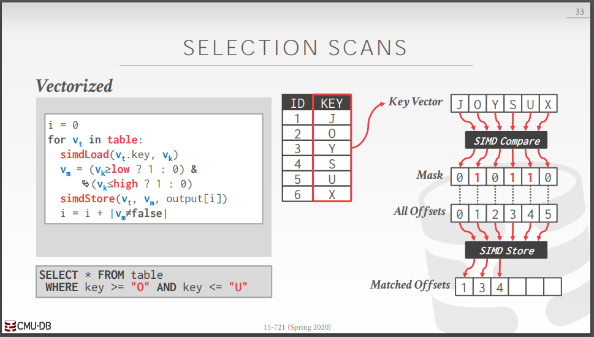

#### VECTORIZATION（向量化）

#### 定义

将算法中的标量运算转换为向量运算。从而可以使用SIMD架构进行加速。

####SIMD INSTRUCTIONS 

Data Movement

Arithmetic Operations

Logical Instructions

Comparison Instructions

Shuffle instructions

Miscellaneous

#### trade-off

优点:提高效率

缺点:需要手写代码，需要数据对齐，数据转移很麻烦。

VECTORIZATION

 Choice #1: Automatic Vectorization  

Choice #2: Compiler Hints

 Choice #3: Explicit Vectorization 使用CPU指令，有可能不可移植

Linear Access Operators :Predicate evaluation → Compression 

Ad-hoc Vectorization → Sorting → Merging 

Composable Operations → Multi-way trees → Bucketized hash tables

#### VECTORIZED OPERATORS

#####Selection Scans

Hash Tables 

Partitioning / Histograms

