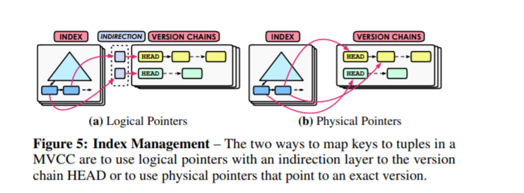

An Empirical Evaluation of In-Memory Multi-Version Concurrency Control

##### 摘要
多版本并发控制(MVCC)是目前最火的事务管理算法。这篇文章进行了MVCC多核扩展上的讨论。 
并发控制协议 （concurrency control protocol） 版本存储（version storage） 垃圾管理（ garbage collection） 索引管理（index management）

##### 2.2 DBMS Meta-Data
事务：DBMS给每个事务一个独立递增的时间戳。
元组：每一个物理version的meta-date都有四个字段：txn-id  begin-ts end-ts pointer
txn-id  每一个没有加写锁的元组这个字段都会被设置成0，大多数DBMS使用64位的txn-ied，所以就可以使用[compare and-swap (CaS)](https://blog.csdn.net/yanluandai1985/article/details/82686486) 指令来更新数值
如果id为$T_id$事务T想要更新元组A，DBMS检查A的txn-id是否是0，如果是0，那么DBMS将将设置txn-id为$T_id$。
begin-ts and end-ts 体现元组version的寿命，初始是0，结束时begin-ts设置为INF。
pointer指向之前或者之后的version。（*在什么情况下是之前什么情况下是之后？*）
#### 3. CONCURRENCY CONTROL PROTOCOL
协议的作用
(1) 判断是否允许事务访问或者修改一个指定版本的元组。 (2)是否允许事务提交修改。
MVCC对(phantom)幻读没有好处。
现有的提供可序列化事务的方法通常有 (1)index的锁 (2)事务提交时候的验证。
##### 3.1Timestamp Ordering(MVTO)
在元组版本中新增加一个read-ts代表最后一个读取该元组的ts。DBMS在会在事务尝试读取或者更新写锁被其他事务持有的version时abort掉这个事务。

当事务T使用read操作读取元组A，DBMS查找一个version使$T_id在$begin-ts和end-ts字段范围之间，且tx-id==0或者==tid。

read需要检查当前事务的Tid是否落在begin-ts和end-ts之间，并且该tuple没有被别的事务锁定，即txn-id=0或等于Tid。如果可以读的话，将read-ts设置为tid。

*begin-ts 和end-ts代表当前version的有效区间，即在对于Tid为begin-ts 与end-ts之间的事务，这条version是合法的。*
当事务T需要加写锁，满足下面两个调教1.Tid>$B_x$->read-ts 2.$B_x$->tx-id==0代表该元组出现了新的修改，当前版本已经过期，所以创建新的版本$B_x+1$。在T结束后，设定$B_x+1$->begin-ts = Tid ,$B_x+1$->end-ts = INF,B_x->end-ts = Tid。代表Bx已经是旧版本$B_x+1$是当前版本。
*思考，如果在$T$运行过程中，出现了一个读操作$T_1$且$T_{1id}>T_id$，是否会读取$B_x$版本的数据？*

##### 3.2Optimistic Concurrency Control(MVOCC)

分为三个阶段 read phase  validation phase write phase。
**read phase** 和MVTO基本相同。
**validation phase ** DBMS给事务另一个时间戳，然后判定read set是否已经被已经提交的事务更新了。如果没有冲突就进入 ** write phase** 新建一个version。并且begin-ts设定为T_commit,end-ts = INF。

##### 3.3Two-phase Locking(MV2PL)
在这个方法里，读操作和写操作都需要获得锁。
write-lock使用txn-id，read lock 在meta-date里新增了一个read-cnt。
在对元组A进行读操作时，和其他方法一样DBMS首先寻找合法的元组版本。如果thx-id==0，read-cnt增加1，如果read-cnt和thx-id都等于1，那么写操作是允许的。当一个事务提交时，DBMS创建一个新的T_commit来更新begin-ts。
死锁的处理：no-wait 方法即发现锁定即重启是最scalable的死锁预防方法。
##### 3.4 Serialization Certifier
这是最后一个协议，DBMS维护一个序列化的图像，为了检测和移除“危险的结构”。
第一个认证器是SSI(序列化快照隔离)，这个方法使用避免写倾斜(write-skew)的方法保证序列化。

有两种方法可以对进行以上的协议优化，
* 第一个方法是允许事务对没有提交的version进行读。但是必须要进行读依赖的搜索来保证序列化，每一个worker维护一个dependency counter。
* 另一个优化方式是允许事务在已经被没有提交的事务读之前提前更新版本，也需要dependency进行控制。

#### 4. VERSION STORAGE
##### 4.1Append-only Storage
所有的元组version都存在同一个同一个表上。更新一个存在的元组时，DBMS首先申请一个新slot，然后复制数据。
###### Oldest-to-Newest(O2N)
效率比较差
###### Newest-to-Oldest(N2O)
搜索方便。插入tuple的时候，需要更新index的指向，但是不需要搜索整个链表。可以让index指向一个逻辑的间接节点，避免频繁更新index。
缺点是，head每次都需要更新，可以通过增加一层地址映射来解决这问题。

###### Time-Travel Storage
是将older tuple存到不同的表上。
master-version存储在time-travel 
每次更新的时候，copy当前版本的tuple到time-travel table上，然后修改main table中的master version为最新的内容，并更新指针指向旧的tuple的index。
###### Delta Storage
只在修改main table中的master version存储与之前版本有变化的内容。
这种方法适合写密集型，不适合读密集型。

#### 5. GARBAGE COLLECTION
1.删除过期的版本2.将相关link断开3.回收空间。
版本过期代表他是被abort的事务创建的或者对任意的事务都没有用处，也就是说end-ts比所有的活跃的T要小，DBMS创建了一个集中的数据结构来保存这样的数据，但是对于多核系统来说集中的数据结构的访问会成为一个瓶颈。
可以通过粗粒度分epoch的方式处理这样的问题。
##### 5.1Tuple Level
###### Background Vacuuming(VAC)
搜索所有的version找出无效的version。可以通过epoch进行优化，还有一种优化是使用bitmap维护。
###### Cooperative Cleaning(COOP)
在遍历过程中判断是否过期，只对O2N有效。但是会造成不访问的元组无法清除的问题，所以要配合VAC使用。

##### 5.2Transaction Level
按照epoch进行删除，当当前epoch的所有事务都结束了，则处理这个epoch所有version。需要DBMS管理每个epoch的元组。

#### 6. INDEX MANAGEMENT

##### 6.1 Logical Pointer
###### Primary Key (PKey): 
identifier就与相应元组的主键相同。
###### Tuple Id (TupleId):
可以使用一个惟一的64位identifier代替主键和一个独立的latch-free hash table 来维护映射信息。 

这种方式不需要经常修改index，因为它的指向永远是固定。比如说指向主键，但是需要再用主键通过primary index找到对应的tuple，这是额外的消耗。或者指向tupleid，另外维护一个数据结构将tupleid对应到物理的tuple地址。适合write-intensive。

#####6.2Physical Pointer
直接存储version的地址。
####7. EXPERIMENTAL ANALYSIS