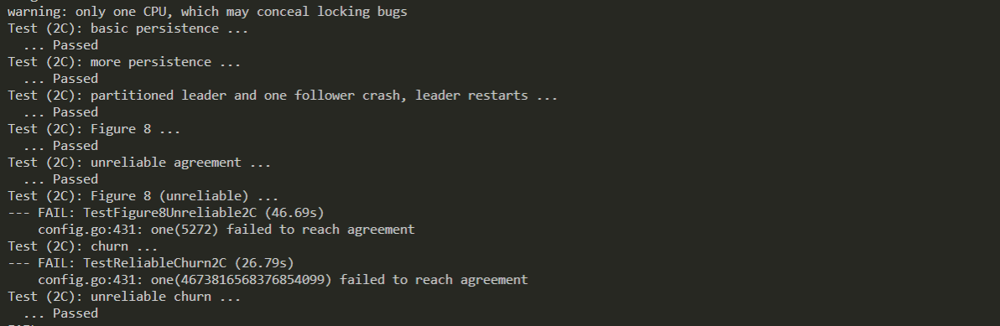

这篇主要是写的是实验心得，设计原理，bug修复，注意事项等相关内容，内容比较杂。代码地址 https://github.com/miamia0/MIT-6.824 欢迎讨论


### 当前进度

- [x] Lab 1
- [x] Lab 2
   - [x] Lab 2A
    - [x] Lab 2B
    - [x] Lab 2C
- [x] Lab 3
   - [x] Lab 3A
   - [x] Lab 3B
- [x] Lab 4

  - [x] Lab 4A
  - [x] Lab 4B
  

### Lab1

---


### Lab2

---


LAB2遇到的一些问题

* 因为Leader在接收到更大的term的时候需要转变回Follower，但是如果转变term后仍然发送了heartbeat会覆盖其他server的log。

* candidate，leader在接收到合法的requestvote或者heartbeat的时候应该立即转变为follower。

* follower在收到任意不合法的requestvote时仍然需要将自己的term进行更新。

* 因为需要用到log的长度作为election的依据，所以在更新log的时候必须将之后的无用log完全丢弃。

* 因为candidate的选举是使用随机时钟来保证每个follower都有被选举的机会，所以在测试条件不是很好的情况下，随机时钟可以将随机返回扩大一些。

* 状态的转变必须是立即的，首要进行的。因为状态代表着进行的操作：leader：发送heartbeat，candidate：进行election，follower：等RPC。在term转变之前的，term和status的相互作用是Raft协议的基础。

  * 一般term的转变都是从低term转变为高term，而高term代表着发言权，低term可以被任意高term所拒绝。
  * 高term的leader可以有至高无上的权力。
  * 低term的leader代表已经是out-of-date的leader
  * 高term的follower可以提示低term的leader转变为follower
  * 低term的candidate遇到高term的follower，leader，candidate都要转变为follower。
  * **leader只会因为变为follower才会转变term**，leader在接收到requestvote时是忽视的，candidate则会判定term。

  

* 多线程同步真的很重要。。

  lab2C需要把currentterm，votefor，log进行persist。

  currentterm和log进行presist比较好理解，而votefor进行persist可能是为了加速重启的时候进行leader选举而进行的举动。等于变相存储了旧时期的leader。

写2C的时候感觉并没有写很多东西····跑完测试会出现nextIndex过慢而fail agreement的问题。

需要对nextIndex增加优化，参考了[student guide](https://thesquareplanet.com/blog/students-guide-to-raft/) ，[大佬博客](https://www.jianshu.com/p/59a224fded77)

```
- If a follower does not have prevLogIndex in its log, it should return with conflictIndex = len(log) and conflictTerm = None.
- If a follower does have prevLogIndex in its log, but the term does not match, it should return conflictTerm = log[prevLogIndex].Term, and then search its log for the first index whose entry has term equal to conflictTerm.
- Upon receiving a conflict response, the leader should first search its log for conflictTerm. If it finds an entry in its log with that term, it should set nextIndex to be the one beyond the index of the last entry in that term in its log.
- If it does not find an entry with that term, it should set nextIndex = conflictIndex.

```


### Lab3

---

#### lab3A

因为我的服务器太渣没法跑完所有测试····虽然一开始PASS了3A但是会有warning，于是去参考了一些了大佬的实现，发现很多人都写了cid和seq作为请求的一部分，cid是作为client的id seq是请求的序列号，根据cid的最后请求序列号判断当前指令是否需要执行。改了以后warning变少了，可能是因为cid的个数比较少可以进行一些查询的优化。

如果leader因为断网无法提交数据，那么会出现RPC无法返回的情况，所以需要改变锁为超时锁

```go
func (kv *ShardKV) lockIndex(logIndex int) Op {
	ch := kv.getLock(logIndex)
	select {
	case op := <-ch:
		return op
	case <-time.After(time.Second):
		return Op{}
	}
}
```

#### lab3B

installRPC部分还有一些bug有几率不会通过。

检查后发现有死锁存在，在一定时间后，各个server都无法发送rpc，看了一下test发现是installsnapshot没有释放锁的问题。

* 在readpersist的时候需要设置rf.commitIndex, rf.lastApplied 等于rf.lastIncludedIndex。
* 一开始把rf.lastIncludedIndex和    rf.lastIncludedTerm和snapshot放在一起存，后来发现还是和raft一起存比较合理。


###Lab4

#### lab4A

基本内容就是lab3加上shard的config切换。

Join 指增加新的replica group，给GID和服务器的映射。当前的group要匀一些数据给他。

Leave 给一个list 的GID，代表这些group要离开， 新建一个configuration不包括这些group，然后把这些服务器的数据分给剩下的group。

Move 包括一些shard number 和GID代表要把这些shard转移到GID上。

Query 进行configuration的查询，也就是查询上面三个RPC的结果。

把实验3的 分配shard应该保证每个group的shard个数尽量平均，变动的shard比较少。

维护一个每个group存储的shard。可以用堆实现，因为golang里面没有priority_queue，所以得自己实现一个堆，先用暴力的方法找最大最小，有时间我再补上手写堆。

#### lab4B

这个任务是在LAB3的基础上实现group之间的shard转移操作。

思考记录

### 1 shard切换与group服务

进行shard切换时，进行切换的group应该都不提供服务。

### 2

在G1將一个shard发送给当前所在的G2时会有三种结果：

* G2的confignum比自己要小，可以立即更新G2的config并且重新开始同步。
* confignum一样大，这种情况是最好的G2直接更新就行。
* G2的confignum比G1要大，这种情况表示发送的数据已经outofdate，但是如果这次confignum的改变对 发送的数据没有影响的话，是否也应该存储呢?
  * V1:如果不存储的话应该reply给G1一个G2的config迫使G1进行重新发送Shard，但是这样应该会导致浪费bandwidth。
  * V2:如果存储的话似乎不会出现什么问题，这次存储等于执行了过去config变化发生的shard移动操作。
* 是否可以将一次config看做一些shard的同步队列。

### 3 发送接收shard的时机

~~因为要保证一个group的信息的serialization，所以所有的改变都需要通过leader来进行变更。当一个config的版本所有shard移动都被满足时，才可以更改group的服务为当前的config。~~

~~但是如果将接收到的部分的shard直接进行改变而leader中途crash掉的话如果没有对改变的shard进行存储，并不能带来新的config的服务，所以必须能够得到一个config改变的所有增加删除操作序列然后统一进行更改。~~

* ~~如果G1服务器得到了c1版本，但是因为其他的Goup（这里设为G2）跳过了某个config(c1)不会把数据发送给G1，G1永远没法得到数据。但是因为所有的group最终都会到一个稳定的config，这个时候对于某一分片x，在第c1版本从G2到G1，在c2版本从G1到G3。因为G2没有得到c2版本，所以G2发送数据给G3,G1无法更新到c1版本，只会直接更新到c2版本。c1版本的更新将会被跳过。由此可知，应该按照版本存储一个更新序列。如果更新序列是完整的话执行所有的shard转移落地工作，然后更新server的config版本。~~
* ~~所有的删除都必须在对方已经得到并落地了版本才可以进行删除。因为没有落地的话，不能保证对方能够完整的更新版本，数据就会被丢弃。当一个config进行更新时，代表着所有的服务器的config都已经更新到合理的位置。这样会产生死锁吧。。。。~~
* ~~可以对于认定的删除操作不进行删除，预设代表删除了。但是之后如果检测到新的版本的config，仍然选择发送这个shard，但是附带的版本号是当前的版本号。~~

~~综上所述，需要多存储的是1.每个Goup的已经更新的config版本2.每个版本已经完成的操作(增删操作)和操作数，以便于完整更新。~~

---

~~update 实现了以后又思考了一下考虑以下情况~~

~~G2在c1版本切换到c2时只会失去S1并发送给G1，而G1在切换到c2时需要获得S1,S2，S2在G3里，而G3错过了c1版本只拿到了c3版本，所以只会发送c3版本+S2，这样的话G1就无法得到c2版本的全部和c3版本的标识全部，这个时候就需要利用G2发送的c2的S1。~~

~~所以之前的按照config进行存储的更新序列。应该更改成按照sid进行存储，在更新时判定此更新的nowConfigNum<=congfigNum<=newConfigNum。~~

---

我是个zz，为什么不直接按顺序取每一个config进行更新呢。

设当前的group为G1版本为C1，在切换到下一个版本的config(C2)时，当前C1持有的shard(S1)和C2中S1对应的group(G2)。

- 如果G1==G2 设置当前S1的有效性不变
- 如果G1!=G2，在当前S1有效时，转发S1给G2。无效时存储下这一转发过程，直到接收到之前版本的S1再进行转发。

设当前的group为G1版本为C3，在切换到下一个版本的config(C4)时，C4持有但是当前C3不持有的shard(S2)和C3中S2对应的group(G2)。

- 如果G1==G2 设置当前S1的有效性不变
- 如果G1!=G2，如果已经有存储好的G2转发来的数据，设置S2有效，并将原来转发来的数据落盘。如果没有已经转发来的数据，存储这一需要得到数据的S2，直到接收到之前版本的S2再进行存储。

### 4 关于seq的问题

```
Think about how the shardkv client and server should deal with `ErrWrongGroup`. Should the client change the sequence number if it receives `ErrWrongGroup`? Should the server update the client state if it returns `ErrWrongGroup` when executing a `Get`/`Put` request?
```

答案是不需要，因为WrongGroup是没有正确提交的任务不会进行服务端的seq更新，更不会影响另一个group。

### 5 

~~在config切换过程中是否应该不提供服务，G1对S1在c1时提供服务，在c2时G2对S1提供服务，G1现在要切换到c2，先把数据D(c1)发送给G2，因为客户端拿到的数据是过期的，会给G1继续发送S1的请求，G1也会继续提供S1的服务直到自己切换成c2，但是当前的数据已经成为了D(c2)了。所以在自己的config切换到c2之前也不应该提供S1的服务了。~~

~~一种方法是设置停等期，在发现config更改时服务器不提供任何写服务。~~

~~还有一种方式是只屏蔽发生切换的shard，创建一个中间状态的config。~~

~~初始状态会有一个问题一开始shard不在任何服务器中，所以指向为0，但是这样使用以上的方法会出现问题。上面的方法是基于：产生数据变换时原shard存在的group G1一定会发送数据给当前的shard存在的group G2，但是因为初始0状态的出现。对于一个S1，c1阶段在G1，c2阶段在G2，G1只拿到了c2，G2先拿到了c1，后拿到了c2。G2一开始很顺利的更新到了c1，因为S1与他无关，c2也顺利的更新到了c2，因为在他看来S1与他无关。但是G2永远无法拿到S1，因为没有人给他发送S1的数据。~~

~~如果把0看做为G0的话则不会出现这个问题。~~

~~我采用了一种0代表所有人的实现，初始化所有人都持有所有的shard。~~

###6 客户端config版本声明

客户端需要声明自己取到的confignum。否则可能会出现config不同步仍然提供服务的情况。

### 7 golang的map是线程不安全的

golang 的map是线程不安全的,即使并发读写没有冲突也会报错(fatal error: concurrent map read and map write)。所以要注意加锁

### 8 更新cidseq的时机

~~因为可能执行一半然后被ban掉了服务器重启，所以需要再保证能够返回时才更新cidseq。要注意的是就算是seq在过去的请求也应该返回OK。~~

我一开始的想法是错误的，所有对服务器状态的更新必须在applych上完成。所以cidseq在指令执行成功时就需要更新了。要注意的是即使是这个命令因为seq比存储的seq要小，也应该返回ok的，因为这可能是网络不稳定导致之前的指令执行完毕没有返回，而重发的指令。

### 9 map 需要deepcopy

map必须要deepcopy！！ 55555 ，如果不进行deepcopy可能在服务器重启的时候加载未来的map然后出现数据append重复的情况。老师在实验页面也强调了。

### 10 接收到shard流程

测试TestMissChange时大概有20%的概率出现shard转移失败的情况。最后确认是转发时候的问题，错误的将部分需要转发的置为了0。

确定了installshard的步骤1.更新cidseq2.如果是历史config的shard进行转发3.如果是当前需要的shard，落盘db 4，如果是未来config的shard先存储然后在未来再落盘到db。

```go
func (kv *ShardKV) excuteInstallShard(op Op) {
	sid := op.Shard
	configNum := op.ConfigNum
	ckid2eq := op.CKid2Seq
	data := op.Data
	for ckid, seq := range ckid2eq {
		kv.cidSeq[ckid] = Max(kv.cidSeq[ckid], seq)
	}
	if op.ConfigNum < kv.wantShardConfig[sid] {
		return
	}
	if configNum < kv.needSendShardConfig[sid] {
		needSendConfigNum := kv.needSendShardConfig[sid]
		needSendConfig := kv.historyConfig[needSendConfigNum]
		gid := needSendConfig.Shards[sid]
		servers := needSendConfig.Groups[gid]
		args := &InstallShardArgs{
			Data:      DeepCopyShardMap(data),
			CKid2Seq:  kv.cidSeq,
			Shard:     sid,
			Config:    needSendConfig,
			ConfigNum: needSendConfig.Num,
			Ckid:      kv.Ckid,
			Seq:       atomic.AddInt64(&kv.seq, 1),
		}
		kv.needSendShardConfig[sid] = 0
		go kv.sendShardToGroup(servers, args)
	}

	if configNum == kv.wantShardConfig[sid] && kv.isVailedShard[sid] == false {
		if kv.config.Shards[sid] == kv.gid {
			kv.db[sid] = DeepCopyShardMap(data)
			kv.isVailedShard[sid] = true
		}
	} else if configNum > kv.wantShardConfig[sid] {
		if _, success := kv.dbInstallShard[configNum]; !success {
			kv.dbInstallShard[configNum] = make(map[int]map[string]string)
		}
		kv.dbInstallShard[configNum][sid] = DeepCopyShardMap(data)
	}
}
```

### 11 总结

完结撒花✿✿ヽ(°▽°)ノ✿

4B是我做的最自闭的实验，花了3天时间debug，每天调试到凌晨2点，睡觉的时候还是在一遍一遍思考自己的bug在哪里。到最后pass掉所有的test真的要哭了。中间想了很多解决办法然后又把之前的想法推翻，过程有点难受，但是做完的感觉还是很有成就感的。